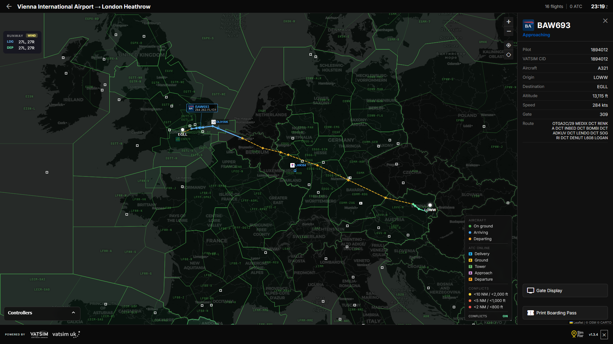
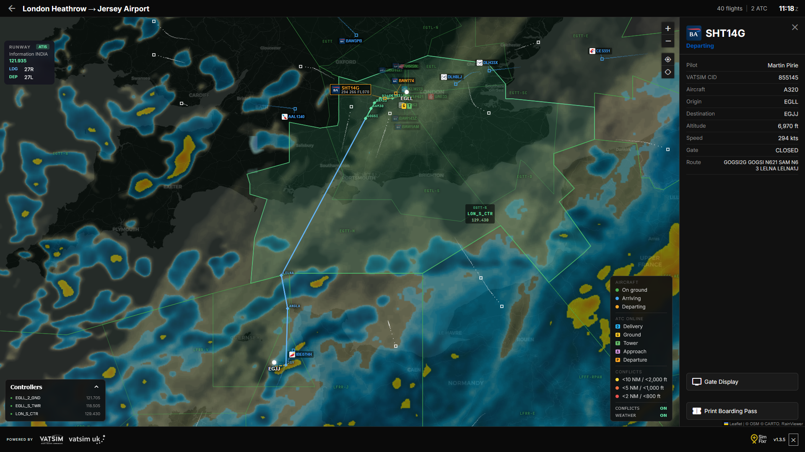

# VATSIM Flight Information Display System
A professional, real-time Flight Information Display System (FIDS) designed for VATSIM operations. This application replicates the visual style and functionality of modern airport information screens found at major international airports.

It is optimised for use on dedicated display monitors in both portrait and landscape orientations.

## Support

If the flight board adds a little extra joy to your sim experience, a coffee helps keep the servers humming and the flight statuses updating.

[](https://buymeacoffee.com/tazmattar)

## Features

### Core Functionality
* **Universal Airport Support:** Instantly load *any* airport on the VATSIM network by searching for its ICAO code in the UI.
* **Direct Link Loading:** Open the board directly to an airport using `?icao=XXXX` (or `?airport=XXXX`) in the URL.
* **Pre-Configured Hubs:** One-click switching between major hubs across the UK, Scandinavia, Western Europe, North America, the Middle East, and Asia Pacific — grouped in a collapsible dropdown for easy navigation.
* **Flight Info Modal:** Click any flight row to open a card showing airline logo, callsign, aircraft type, status, gate, time, and a live SVG route arc from origin to destination. A **Track on Live Map** button starts tracking and navigates directly to the radar map.
* **Real-Time Data:** Automatically fetches and refreshes pilot and flight plan data from the VATSIM Public Data API (v3) every 30 seconds.
* **Live WebSockets:** Uses Socket.IO to push updates immediately to the client without requiring a page refresh.
* **Header Widgets:** Live ATC status with controller popover, METAR-driven weather icon and temperature display, and a compass link to the Live Map. Hover the weather widget to reveal a **METAR popover** with the raw string and decoded wind, visibility, cloud, temperature/dewpoint, and QNH.
* **Live Radar Map:** Dedicated page at `/map/<ICAO>` showing all departures and arrivals as real-time aircraft markers on a dark Leaflet map. Markers are color-coded (green = ground ops, blue = arrivals, orange = departures) and rotated to show heading. Click any aircraft to open a detail panel with callsign, status, route, gate, and a link to the gate display. An ATC panel lists online controllers with markers at approximate positions. Uses Socket.IO for live updates.
* **Active Runway Detection:** The Live Map parses VATSIM ATIS text to identify runways in use, colour-highlighting them on the OSM runway overlay (blue = arrivals, green = departures, yellow = both). Falls back to METAR wind calculation when no ATIS is online. A HUD overlay shows the active runways, ATIS information code, and frequency.
* **TCAS-Style Conflict Detection:** En-route and approaching aircraft are continuously monitored for proximity conflicts using ICAO separation minima. Three severity tiers are visualised as pulsing SVG rings on aircraft icons and dashed connecting polylines: yellow (<10 NM / <2,000 ft), orange (<5 NM / <1,000 ft), red (<2 NM / <800 ft). Aircraft below 1,000 ft or in ground/departure phases are excluded. In tracked-flight mode only pairs involving the tracked callsign are shown. Toggleable from the map legend with state persisted in localStorage.
* **Live Weather Overlay:** Combined cloud cover (OpenWeatherMap) and precipitation radar (RainViewer) overlay, toggleable from the map legend. Cloud layer renders beneath radar. Auto-refreshes every 10 minutes. State persisted in localStorage.
* **Airspace Overlays:** Controlled airspace boundaries (CTR, TMA, Restricted, Danger, Prohibited, ATZ, MATZ) rendered as colour-coded polygons via OpenAIP, with altitude bands shown on hover. Toggleable from the map legend; state persisted in localStorage.
* **Full-Page Gate Display (Streamer Mode):** Dedicated full-page gate monitor at `/gate/<ICAO>/<callsign>` — designed for OBS overlays and streaming. Features a clean white layout with large gate number, airline logo, flight number, destination, departure time, aircraft, and status pill. Accent colours are dynamically extracted from the airline's logo.
* **Help / User Guide:** Built-in modal accessible from the header, covering all features and keyboard shortcuts.
* **Responsive Layout:**
    * **Landscape Mode:** Displays Departures and Arrivals side-by-side.
    * **Portrait Mode:** Automatically stacks tables vertically for optimal use on vertical monitors.
* **Auto-Pagination Engine:** Smart pagination detects overflow and splits flights into pages with indicators, automatically cycling through pages when needed.
* **Event Ticker:** A slim scrolling ticker bar appears above the footer whenever the current airport has an active or upcoming VATSIM event (within 24 hours), sourced from the VATSIM Events API. Automatically hidden when no events are scheduled.

### Track Flight Mode
* **Start tracking:** Click any flight row to open the Flight Info modal, then click **Track on Live Map**.
* **One active flight:** Tracking a new flight replaces the previous tracked callsign.
* **Stop tracking:** Press the `×` on the tracking chip in the header.
* **Header indicator:** Shows tracked flight in the format `Tracking Flight BAW123 (EGLL-KJFK)`.
* **Persistence:** The tracked callsign is saved in local storage and restored after refresh/reconnect.
* **Auto-switch rule:** The board switches only after the tracked flight reaches a departure/airborne phase (`Departing`, `En Route`, and later statuses).
* **Pre-departure hold:** It does **not** switch while the flight is at `Check-in`, `Boarding`, `Pushback`, or `Taxiing`.
* **Switch safety:** Cooldown and leg guards prevent rapid or looping airport switches.

### Intelligent Logic
* **UKCP Stand Integration:** Direct integration with the VATSIM UK Controller Panel API to display real-time stand assignments for UK airports (EGLL, EGKK, etc.). Stand definitions are fetched live from [`https://ukcp.vatsim.uk/api/stand/dependency`](https://ukcp.vatsim.uk/api/stand/dependency) at startup and cached locally; falls back to the bundled snapshot if the API is unreachable.
* **Dynamic OSM Fallback Stand Data:** When an airport is not in the manual `stands.json` database, the system automatically queries OpenStreetMap via the Overpass API to fetch real-time parking position data. This ensures gate detection and status accuracy even for unconfigured airports. OSM data is only fetched on-demand when an airport is searched, maintaining `stands.json` as the primary source.
* **Status Detection:** Automatically determines flight phases (Boarding, Taxiing, Departing, Landing) based on transponder codes, ground speed, and altitude.
* **Smart Delay Calculation:** Compares scheduled departure times against current UTC time to generate accurate delay warnings.
* **Geospatial Filtering:**
    * **Departures:** Visible while at the gate and until they leave the immediate terminal airspace (>80 km).
    * **Arrivals:** Display from en-route phase through approach/landing, then persist until parked.
* **Smart Check-In Allocation:** Deterministically assigns check-in desks based on airline and terminal, with airport-specific logic for supported hubs.

### Visual Design & Dynamic Theming
* **Modular Theme System:** Each airport has its own CSS theme file for easy customization.
* **Dynamic Theme Loading:** Themes are loaded on-demand. Non-configured airports automatically use a high-contrast "Default" theme.
* **Airport-Specific Branding:** The interface adapts to match real-world airport branding:
    * **LSZH (Zurich):** High-contrast White/Black header with Yellow accents.
    * **LSGG (Geneva):** Geneva Blue headers with White text.
    * **LFSB (Basel):** Immersive "EuroAirport Blue" background.
    * **EGLC (London City):** City Airport Blue (#3542C3) header with white text, white rows with black text, and grey footer.
    * **EGLL (Heathrow):** Classic Heathrow Yellow header with Black text.
    * **EGKK (Gatwick):** Distinctive Gatwick Yellow and Black styling.
    * **EGSS (Stansted):** Stansted Yellow with Black text.
    * **EHAM (Amsterdam):** Schiphol-inspired theme based on real FIDS reference.
    * **EGCC (Manchester):** Yellow and Black header with dark rows and alternating grey, lowercase styling.
    * **EDDF (Frankfurt):** Authentic Solari split-flap display aesthetic with animated mechanical character flips, Lufthansa Blue footer, and terminal indicators.
    * **LFPG (Paris CDG):** ADP-inspired deep midnight blue with alternating blue rows and sky-blue column headers.
    * **KJFK (New York):** JFK Yellow and Black.
    * **KEWR (Newark):** Yellow and Black with terminal badges.
    * **RJTT (Tokyo Haneda):** Black header with Green accent lines.
    * **ESSA (Stockholm Arlanda):** Arlanda Blue with bilingual Swedish/English footer.
    * **EKCH (Copenhagen):** and 15 further Scandinavian airports (EKBI, EKYT, EKAH, ENGM, ENBR, ENVA, ENZV, ENTO, ESGG, ESSB, ESPA, ESKN, ESOW, ESSV, ESMS) — all with VATSIM Scandinavia verified stand data.
* **Hybrid Display Style:**
    * **Flight Data:** Rendered as clean, high-visibility text.
    * **Status Column:** Rendered as solid, edge-to-edge colored blocks for instant readability.
* **Advanced Logo Handling:** * **Dynamic Resolution:** Automatically fetches and maps airline codes (ICAO to IATA) to pull high-quality logos from the web.
    * **Fallback System:** Prioritizes local files for special ops (FedEx, Rega), then falls back to Kiwi.com and Kayak APIs for commercial carriers.

## Screenshots

### Zurich (LSZH) - Classic Style


### Schipol (EHAM) - White Theme


### London Heathrow (EGLL) - Yellow Theme


### Frankfurt (EDDF) - Split-Flap Theme


## Live Map

### Flight Tracking Map


### Weather Radar



## Technical Stack

* **Backend:** Python 3.8+, Flask, Flask-SocketIO
* **Scheduler:** APScheduler (Background data fetching)
* **Frontend:** HTML5, CSS3 (Flexbox/Grid), JavaScript (ES6+), Leaflet (map)
* **Data Sources:**
    * VATSIM Data API v3
    * VATSIM Events API (Event ticker)
    * UKCP API (Stand assignments for UK airports)
    * VATSIM Scandinavia Ground Radar Plugin Data (Stand assignments for Scandinavian airports — used with permission under a non-commercial attribution licence)
    * OpenStreetMap Overpass API (Dynamic stand fallback for unconfigured airports)
    * OpenWeatherMap API (Cloud cover map overlay)
    * GitHub Airline Codes Database (Logo mapping)
* **Theme System:** Modular CSS architecture with dynamic loading

## Current Configured Airports

### United Kingdom
| ICAO | Name | Stands | Theme |
|------|------|--------|-------|
| EGLC | London City Airport | 20 | City Blue, White and Grey |
| EGLL | London Heathrow | 250 | Heathrow Yellow |
| EGKK | London Gatwick | 184 | Gatwick Yellow |
| EGSS | London Stansted | 144 | Stansted Yellow |
| EGCC | Manchester Airport | 117 | Manchester Yellow and Black |

### Scandinavia †
| ICAO | Name | Stands | Theme |
|------|------|--------|-------|
| EKCH | Copenhagen Airport | 156 | Default |
| EKBI | Billund Airport | 18 | Default |
| EKYT | Aalborg Airport | 14 | Default |
| EKAH | Aarhus Airport | 12 | Default |
| ENGM | Oslo Gardermoen | 83 | Default |
| ENBR | Bergen Airport | 36 | Default |
| ENVA | Trondheim Airport | 28 | Default |
| ENZV | Stavanger Airport | 38 | Default |
| ENTO | Sandefjord Airport | 16 | Default |
| ESSA | Stockholm Arlanda | 138 | Arlanda Blue |
| ESGG | Gothenburg Airport | 52 | Default |
| ESSB | Stockholm Bromma | 22 | Default |
| ESPA | Luleå Airport | 17 | Default |
| ESKN | Stockholm Skavsta | 14 | Default |
| ESOW | Stockholm Västerås | 11 | Default |
| ESSV | Visby Airport | 10 | Default |
| ESMS | Malmö Airport | 27 | Default |

† Stand data provided by [VATSIM Scandinavia](https://vatsim-scandinavia.org) under a non-commercial attribution licence. See [docs/scandinavia_integration.md](docs/scandinavia_integration.md).

### Western Europe
| ICAO | Name | Stands | Theme |
|------|------|--------|-------|
| LSZH | Zurich Airport | 153 | White/Black/Yellow |
| LSGG | Geneva Airport | 31 | Geneva Blue |
| LFSB | EuroAirport Basel | 68 | EuroAirport Blue |
| EDDF | Frankfurt Airport | 170 | Solari Split-Flap Dark |
| LFPG | Paris CDG | 508 | ADP Midnight Blue |
| EHAM | Amsterdam Schiphol | 276 | Schiphol Grey |
| LKPR | Prague Airport | — | Default |

### North America
| ICAO | Name | Stands | Theme |
|------|------|--------|-------|
| KJFK | New York JFK | 205 | JFK Yellow and Black |
| KEWR | Newark Liberty | 120 | Newark Yellow and Black |

### Middle East
| ICAO | Name | Stands | Theme |
|------|------|--------|-------|
| OMDB | Dubai International | — | Default |

### Asia Pacific
| ICAO | Name | Stands | Theme |
|------|------|--------|-------|
| RJTT | Tokyo Haneda | 238 | Haneda Dark |

*Note: Any other airport can be loaded via the "+" button in the UI.*

## License

This project is open-source and available under the **GNU AGPLv3 License**. See the [LICENSE](LICENSE.md) file for more details. 

See [POLICY.md](POLICY.md) for branding, data usage terms, and disclaimers regarding flight simulation use.

## Acknowledgements

* **Data:** VATSIM Network & UK Controller Panel (UKCP)
* **Logos:** Kiwi.com, Kayak, and airline-codes database
* **Fonts:** Roboto Condensed, JetBrains Mono, and B612 via Google Fonts
* **Stand Data (UK airports):** [VATSIM UK Controller Panel](https://ukcp.vatsim.uk) — live stand assignments via API
* **Stand Data (Scandinavian airports):** [VATSIM Scandinavia](https://vatsim-scandinavia.org) — Ground Radar Plugin stand coordinates used with permission under a non-commercial attribution licence. Special thanks to **Thor Høgås** for approving the integration. See [docs/scandinavia_integration.md](docs/scandinavia_integration.md) for full licence terms.
* **Stand Data (other airports):** Extracted from airport charts and Google Earth; dynamic fallback provided by [OpenStreetMap](https://www.openstreetmap.org/) contributors via the Overpass API

## Roadmap

- [x] Add more European airports (EGKK, EGLC, EGSS, EHAM added)
- [x] Add North American airports (KJFK added)
- [x] Implement custom themes for major hub airports
- [x] Universal Airport Search (Dynamic loading)
- [x] Asian Pacific airports (RJTT added)
- [x] Solari split-flap display theme (EDDF added)
- [x] Add METAR/weather display widget
- [x] Add ATC/controller widget with live popover
- [x] VATSIM event ticker (live event detection per airport)
- [x] Additional European hubs (EGCC, LFPG added)
- [x] Built-in Help / User Guide modal
- [x] METAR decoded popover (wind, visibility, cloud, temp/dew, QNH)
- [x] Gate Display Board modal (per-flight info card with status badge)
- [x] Full-page Gate Display for streamers with dynamic airline accent colours
- [x] Live Radar Map with real-time aircraft tracking and ATC overlay
- [x] TCAS-style conflict detection on the radar map (three severity tiers, toggleable)
- [x] Flight Info Modal with SVG route arc and one-tap Track on Live Map CTA
- [x] Active runway detection on Live Map (ATIS parsing + METAR wind fallback)
- [x] Live weather overlay on Live Map (RainViewer radar + OWM cloud cover, toggleable)

## Bonus - Running as a Dedicated Kiosk Display

Want to run the flight board on a dedicated monitor? Here's how to set up a Raspberry Pi (or any Linux machine) as a fullscreen kiosk display.

### Hardware Requirements
- Raspberry Pi 4B (or any Linux PC)
- Monitor (works great in portrait mode!)
- Optional: Bluetooth mouse for interaction
- Network connection to your Flask server

### Quick Setup Guide

**1. Install Ubuntu Server 24.04 LTS**

Flash to SD card and boot up.

**2. Install GUI Components & Fonts**
```bash
sudo apt update && sudo apt upgrade -y
sudo apt install -y xorg openbox lightdm unclutter
sudo snap install chromium

# Install international fonts for proper character rendering
sudo apt install -y fonts-noto-cjk fonts-noto-cjk-extra fonts-noto-color-emoji
```

**3. Configure Auto-Login**

```bash
sudo nano /etc/lightdm/lightdm.conf
```

Add under `[Seat:*]`:
```ini
autologin-user=YOUR_USERNAME
autologin-user-timeout=0
user-session=openbox
```

**4. Create Kiosk Autostart Script**

```bash
mkdir -p ~/.config/openbox
nano ~/.config/openbox/autostart
```

Paste this (replace `YOUR_SERVER_IP` with your Flask server's IP):

```bash
#!/bin/bash

# Disable screen blanking
xset s off
xset -dpms
xset s noblank

# Hide mouse cursor
unclutter -idle 0.1 &

# Optional: Rotate to portrait mode
# xrandr --output HDMI-1 --rotate right &
# sleep 2

# Wait for network
sleep 5

# Launch fullscreen kiosk
/snap/bin/chromium \
  --kiosk \
  --noerrdialogs \
  --disable-infobars \
  --no-first-run \
  --app=http://YOUR_SERVER_IP:5000
```

```bash
chmod +x ~/.config/openbox/autostart
```

**5. Reboot**

```bash
sudo reboot
```

Your Pi will now boot directly into the flight board in fullscreen!

### Optional: Portrait Mode

To rotate the display 90° for portrait orientation, add this line to your autostart script **before** the Chromium launch:

```bash
xrandr --output HDMI-1 --rotate right &
sleep 2
```

The CSS automatically adapts to stack Departures/Arrivals vertically in portrait mode.

### EDDF Lite Animation Mode (Raspberry Pi)

The Frankfurt (EDDF) theme uses a Solari split-flap character animation. On lower-powered devices like the Raspberry Pi 4B, this can be sluggish due to the volume of simultaneous CSS animations.

**Lite mode activates automatically** — no configuration needed. It uses two signals to distinguish a Pi kiosk from a tablet or desktop:

| Device | Orientation | Pointer | Result |
|--------|-------------|---------|--------|
| Pi kiosk (monitor) | Portrait | Mouse / none (`fine`/`none`) | Lite mode ✓ |
| iPad / Android tablet | Portrait | Touchscreen (`coarse`) | Full animation ✓ |
| Desktop / laptop | Landscape | Any | Full animation ✓ |

Lite mode replaces the per-character animation with a simple per-cell opacity fade — visually clean, GPU-friendly, and completely invisible to desktop and tablet users.

To override the automatic behaviour (persisted in `localStorage`):
- `?lite=1` — force lite mode on (e.g. landscape Pi kiosk)
- `?lite=0` — force full animation on (e.g. Pi with touchscreen)

Only applies to the EDDF theme. All other themes are unaffected.

### Optional: Bluetooth Mouse

```bash
sudo apt install -y bluez bluez-tools
sudo systemctl enable bluetooth
bluetoothctl
```

In bluetoothctl:
```
power on
agent on
scan on
# Wait for your mouse to appear, then:
pair XX:XX:XX:XX:XX:XX
trust XX:XX:XX:XX:XX:XX
connect XX:XX:XX:XX:XX:XX
exit
```

### Updating the Display

**Frontend changes** (JavaScript/CSS/HTML) update automatically - just hard refresh:
```bash
ssh user@pi-ip
DISPLAY=:0 xdotool search --class chromium key ctrl+shift+r
```

**Backend changes** (Python) require restarting Flask on your server (not the Pi).

### Troubleshooting

**Black screen?**
- Check `/var/log/lightdm/lightdm.log`
- Verify username in lightdm.conf matches your actual user

**Can't reach server?**
```bash
ping YOUR_SERVER_IP
curl http://YOUR_SERVER_IP:5000
```

**Wrong display orientation?**
```bash
# Check current rotation
DISPLAY=:0 xrandr

# Change rotation (normal/left/right/inverted)
DISPLAY=:0 xrandr --output HDMI-1 --rotate right
```

### Architecture

The Pi acts as a "dumb terminal" - all processing happens on your Flask server:

```
┌─────────────────────┐
│   Flask Server      │  ← Fetches VATSIM data
│   (Proxmox/PC)      │  ← Processes flight logic
│   Port 5000         │  ← Serves web interface
└──────────┬──────────┘
           │ HTTP + WebSocket
           ↓
┌─────────────────────┐
│   Raspberry Pi      │  ← Just displays browser
│   (Kiosk Mode)      │  ← No processing
└─────────────────────┘
```

This keeps the Pi lightweight and all your logic centralized on a proper server.

---
